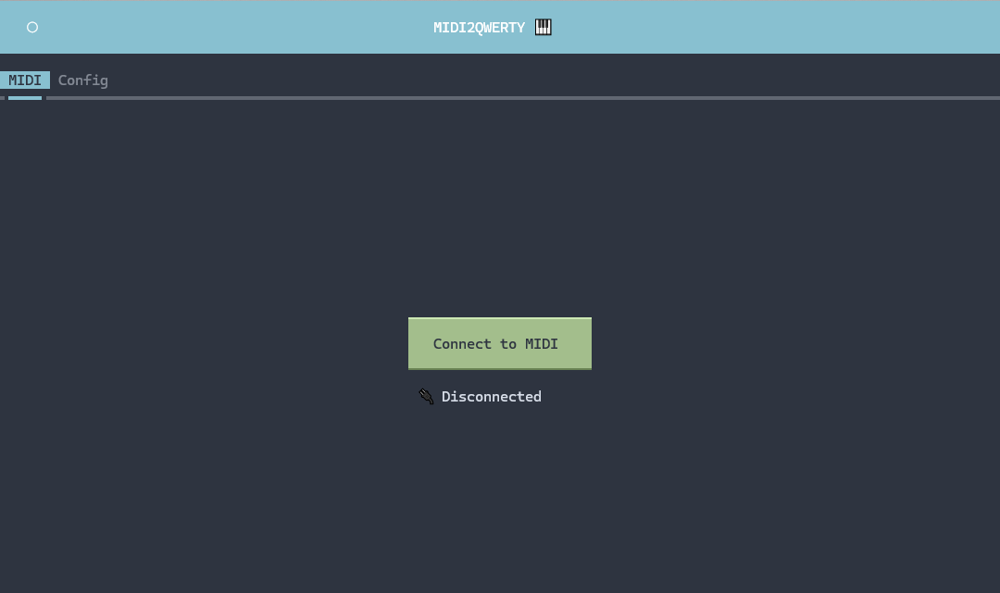
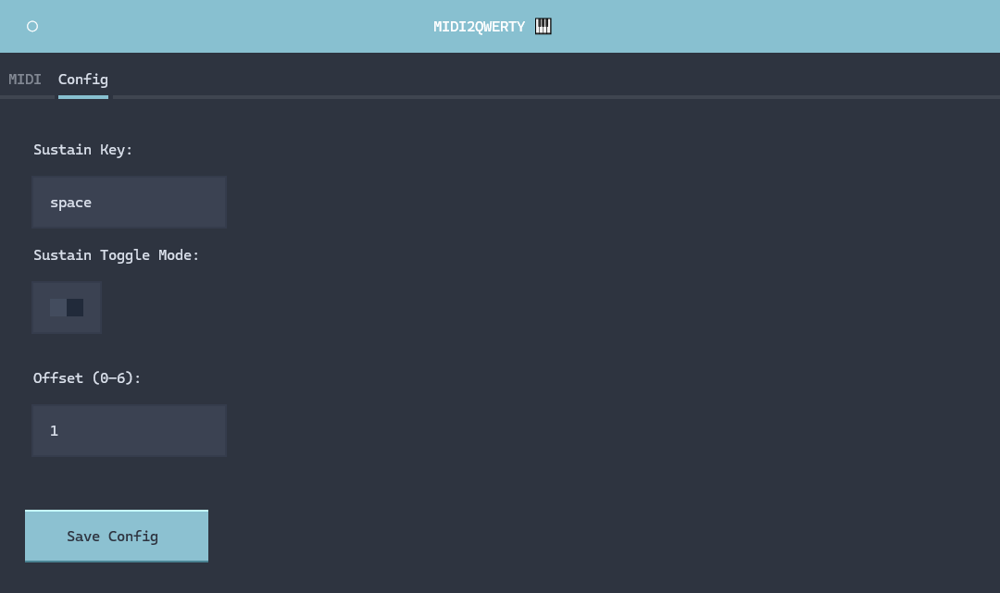

# MIDI2QWERTY 🤗

#### Transform your **MIDI keyboard** into a **QWERTY keyboard!**

### 🚀 **Getting Started**

#### 1. Install **Python** (Skip this step if it's already installed)

Download it from: **`https://www.python.org/downloads/`**

Make sure to check the box **Add Python to PATH** during installation.

---

#### 2. Download **MIDI2QWERTY**

Download the ZIP from:

**`https://github.com/AbobrinhaSince1999/MIDI2QWERTY/archive/refs/heads/main.zip`**

#### 3. Unzip and open the **MIDI2QWERTY** folder

Double-click on **`setup.bat`**  
Wait until the message **"Setup complete!"** appears, then close the window.

---

#### 4. Start the application

Double-click on **`start.bat`** to launch the program.

---

### ✅ **Tested On**

- **Digital Piano Yamaha P-145**

---

### **Screenshots**

---

### 📌 **Config**

**Sustain Key** (_for Roblox piano games_)

- The key used to **sustain notes** in Roblox piano games.

- Default: **Spacebar**

**Sustain Toggle Mode** (_for Roblox piano games_)

- Determines whether the **Sustain Key** must be **held down** or can be toggled **on/off.**

- Default: **Disabled** (you must **hold** the sustain key to sustain notes)

**Offset** (for MIDI keyboards with **88** keys only)

- Many virtual pianos start at the **2nd octave.**

- Set to **1** to shift the starting point to the **2nd octave** (default for most virtual pianos).

- Set to **0** if using a **61-key** keyboard or if your keys already match the virtual piano.
